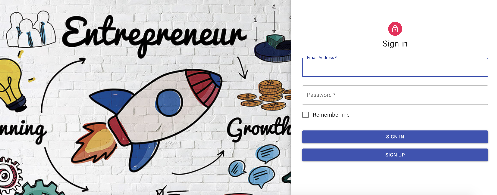
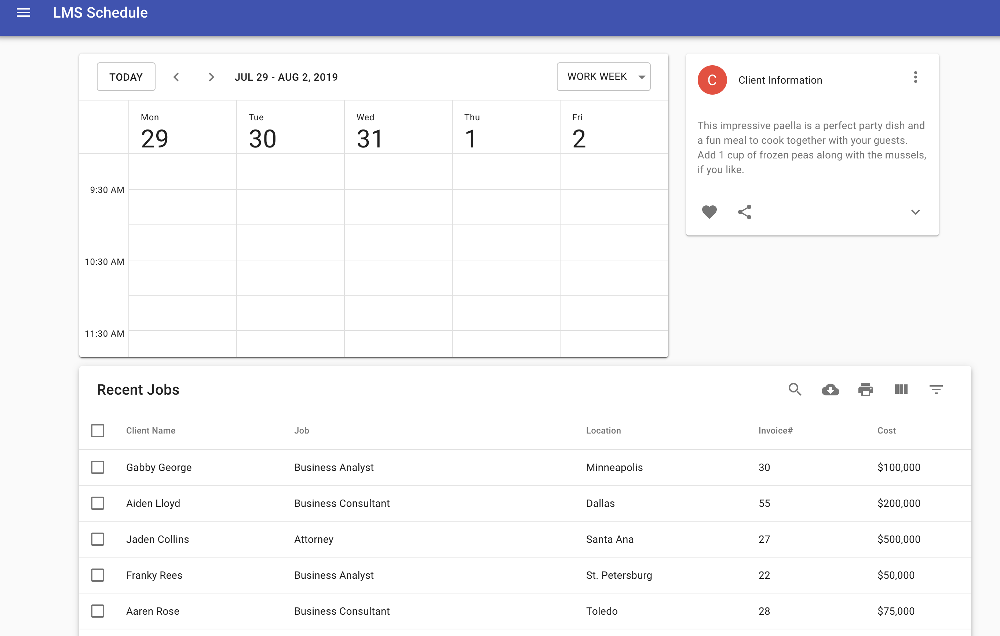
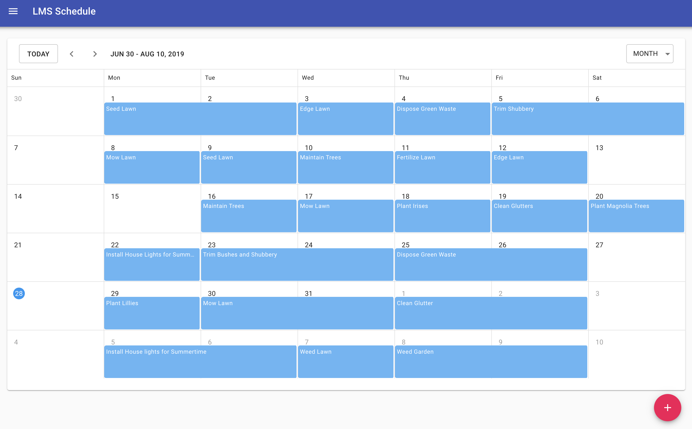
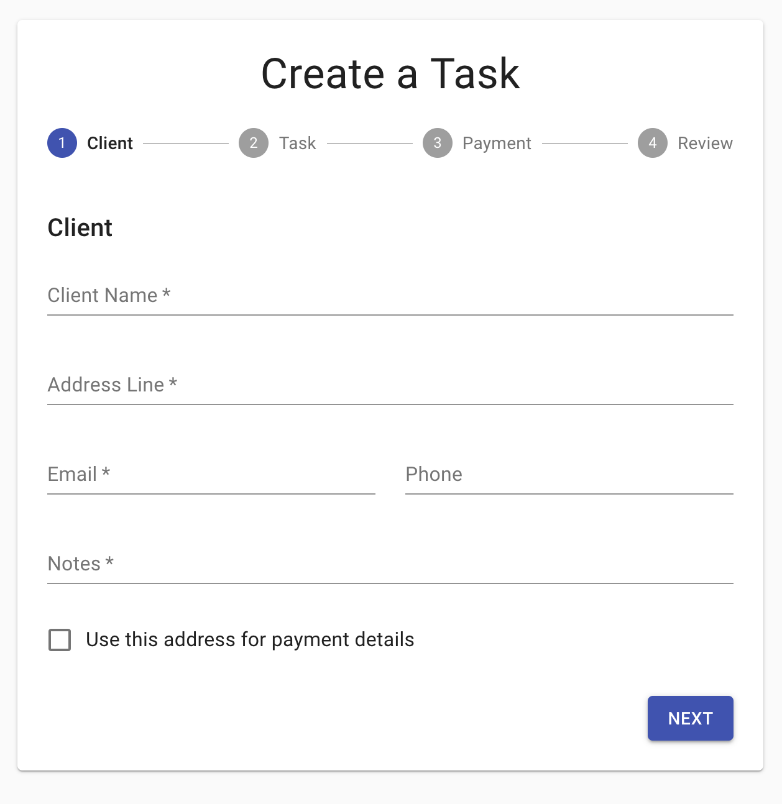

# Project3-LMS Schedule

### About the App:
This is an CRM app for beginning entrepreneurs who deliver services to people's homes.  It promotes growth by keeping track of customer's contact information (address, phone number, and email), by showing time availability and scheduling next appointments, and by creating a new task for a customer.  It allows for the beginning entrepreneurs to easily organize their business so that they can focus on their customers, and keeping their business growing.

### About the Dev Team:
* Michael Glosser,
* Lucy Quinn, and 
* Samuel Fillingim

### Inspiration for this App:
Michael Glosser was the inspiration for this app.  One of his side hustles was tuning pianos.  He needed to keep track of his client and the services rendered, yet he did not like any of the CRM app available.  He had to use the features of many different CRM app to get what he wanted.  He started with QuickBooks, but QuickBooks only allowed him to keep track of the financial records.  For his last project at KU Coding Bootcamp, he decided to make his CRM app with the help of Lucy Quinn and Samuel Fillingim.

